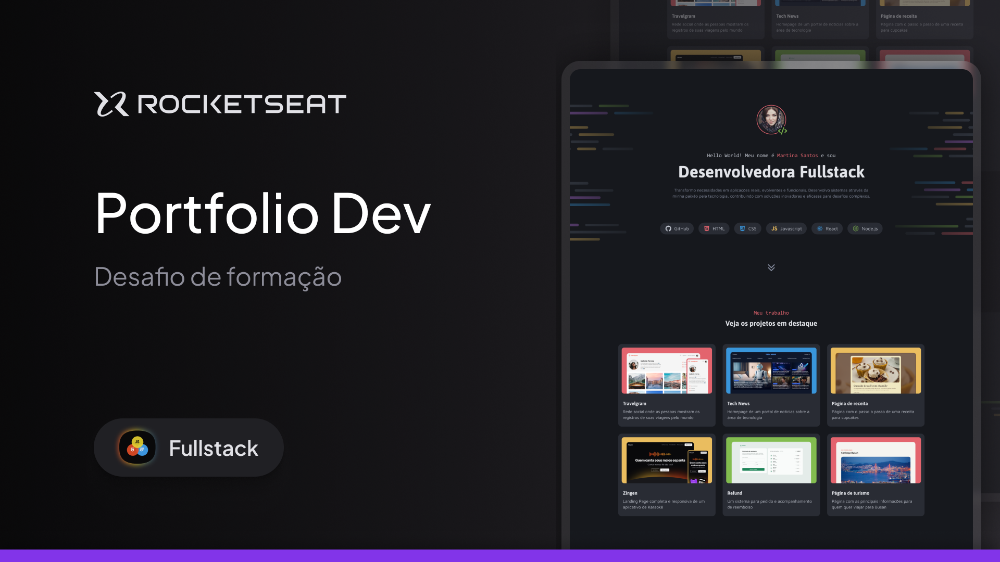

# projeto
<h1 align="center">Portfólio Dev </h1>

progama exclusivo e gratuito, promovido pela Rocketseat para ensino de tecnologias WEB.  

  <a href="#-tecnologias">Tecnologias</a>&nbsp;&nbsp;&nbsp;|&nbsp;&nbsp;&nbsp;
  <a href="#-projeto">Projeto</a>&nbsp;&nbsp;&nbsp;|&nbsp;&nbsp;&nbsp;
  <a href="#-layout">Layout</a>&nbsp;&nbsp;&nbsp;|&nbsp;&nbsp;&nbsp;
  <a href="#memo-licença">Licença</a>

 

  

## 🚀Portfolio Dev!

Esse projeto foi desenvolvido com as seguintes tecnologias:

- HTML e CSS
- Git e Github
- Figma

## 💻 Projeto
Portifólio Dev, mostra o que aprendi ate hoje!

- [Visite o projeto online]([https://lucasgwmes.github.io/portifolio-dev/)

## 🔖 Layout

Você pode visualizar o layout do projeto através [DESSE LINK](https://www.figma.com/design/ypaVzEaqHUaUNMso9K3FOm/Portfolio-Dev-(Community)?node-id=0-1&node-type=canvas&t=IB7ed3LcHBDaJft3-0). É necessário ter conta no [Figma](https://figma.com) para acessá-lo.

## :memo: Licença
